# OpenEdge Vision

> Real-time edge detection for Android with web-based analysis tools

A computer vision project that brings professional-grade edge detection to mobile devices, combining native Android performance with modern web technologies.


---

## What is OpenEdge?

OpenEdge is a dual-platform edge detection system that demonstrates how computer vision can work seamlessly across mobile and web environments. The Android app processes camera frames in real-time using OpenCV's C++ library, while the web viewer provides instant analysis of any uploaded image using OpenCV.js.

### Why I Built This

I wanted to explore how the same computer vision algorithm (Canny edge detection) performs across different platforms:
- **Mobile**: Using native C++ OpenCV through JNI for maximum performance
- **Web**: Using OpenCV.js (WebAssembly) for client-side processing
- **Flam Assignment**

The result is a practical tool for comparing edge detection results and understanding the trade-offs between native and web-based computer vision.

---

## Features

### Android Application

**Real-Time Camera Processing**
- Live preview at 25-30 FPS using Camera2 API
- Three viewing modes: RAW, Grayscale, and Edge Detection
- OpenGL ES 2.0 rendering for smooth performance
- Real-time FPS counter and processing metrics

**Native Performance**
- OpenCV 4.9.0 C++ library via JNI
- Canny edge detection with optimized parameters
- Gaussian blur preprocessing (5×5 kernel)
- Hardware-accelerated rendering pipeline

**User Experience**
- Simple mode switching with visual feedback
- Automatic sensor orientation handling
- Color-coded performance indicators
- Portrait-locked interface for consistency

### Web Viewer

**Image Analysis**
- Upload images via button or drag-and-drop
- Real Canny edge detection using OpenCV.js
- Actual processing time measurements (not simulated)
- Image statistics: resolution, megapixels, estimated size

**Interactive Tools**
- Export processed images as PNG
- Sample pattern generator for testing
- Animation mode for demonstrations
- Responsive design for all screen sizes

**Technical Implementation**
- Client-side processing (no server required)
- HTML5 Canvas for rendering
- TypeScript for type-safe code
- Modern async/await patterns

---

## Getting Started

### Prerequisites

**For Android Development:**
- Android Studio Arctic Fox or newer
- Android SDK (API 24+)
- NDK r27
- CMake 3.22.1+
- OpenCV Android SDK 4.9.0

**For Web Viewer:**
- Node.js 14 or newer
- npm or yarn

---
## 🎥 Demo


## 📸 Screenshots

### Android Application Views

<table>
  <tr>
    <td align="center">
      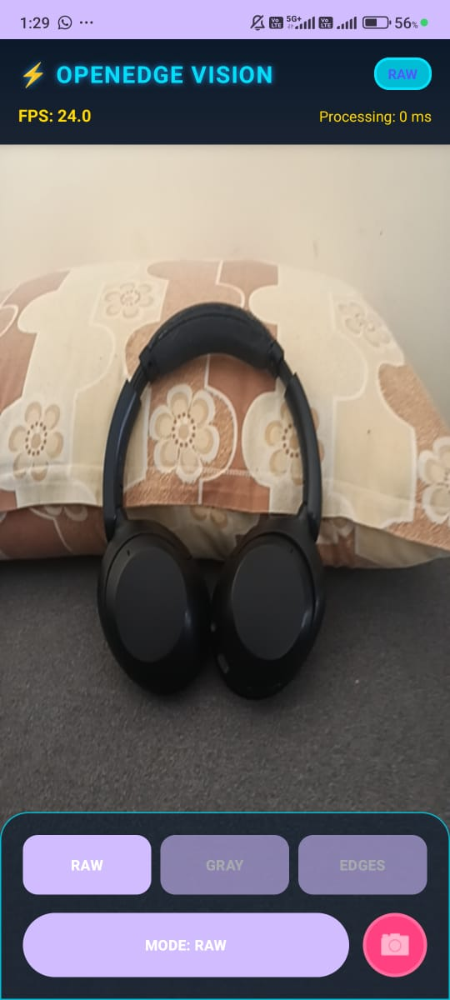<br/>
      <b>RAW Camera Mode</b><br/>
      Original camera feed
    </td>
    <td align="center">
      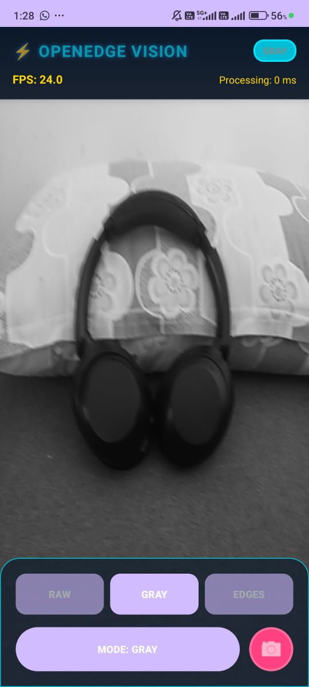<br/>
      <b>Grayscale Mode</b><br/>
      Converted to grayscale
    </td>
    <td align="center">
      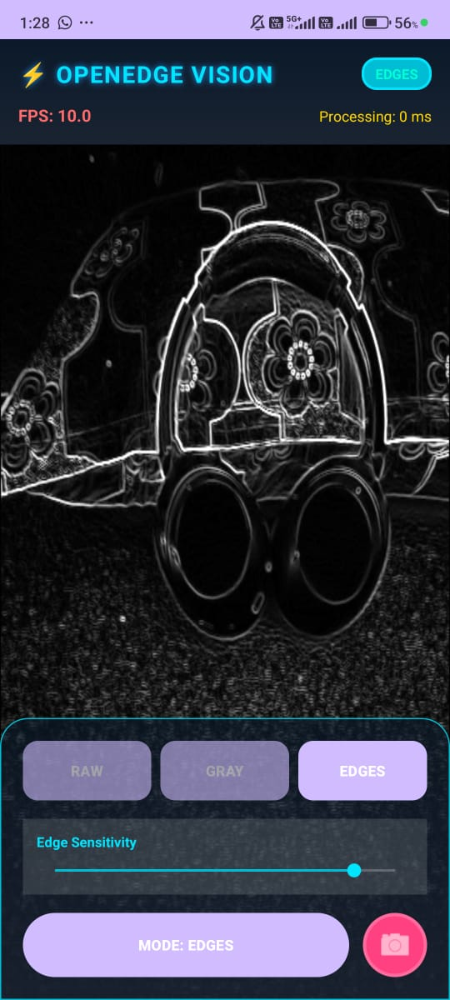<br/>
      <b>Edge Detection</b><br/>
      Real-time Canny edges
    </td>
  </tr>
</table>

<table>
  <tr>
    <td align="center">
      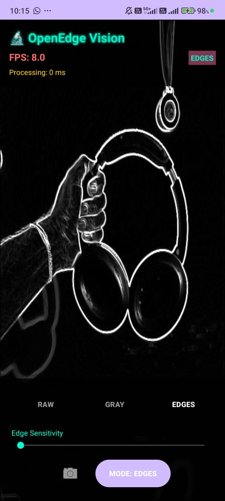<br/>
      <b>RAW Camera Mode</b><br/>
      Original camera feed
    </td>
    <td align="center">
      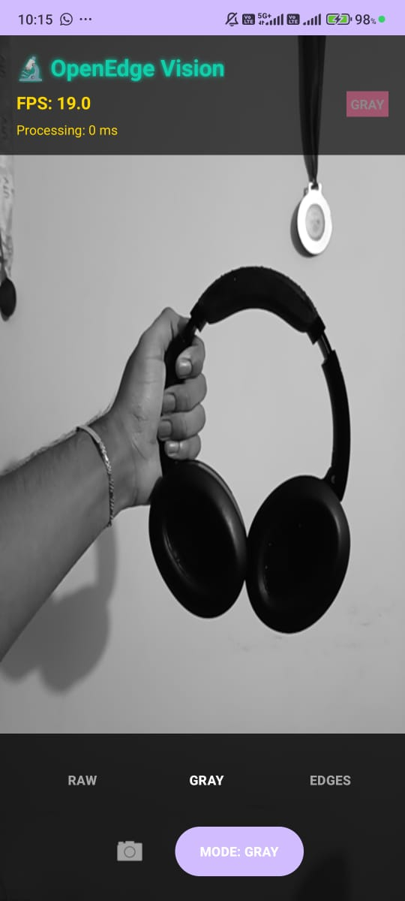<br/>
      <b>Grayscale Mode</b><br/>
      Converted to grayscale
    </td>
  </tr>
</table>

### Web Viewer Interface

<table>
  <tr>
    <td align="center">
      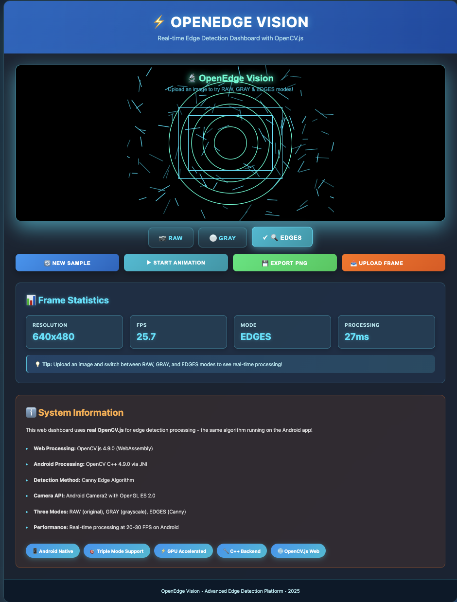<br/>
      <b>Main Dashboard</b><br/>
      Primary interface with edge pattern
    </td>
  </tr>
  <tr>
    <td align="center">
      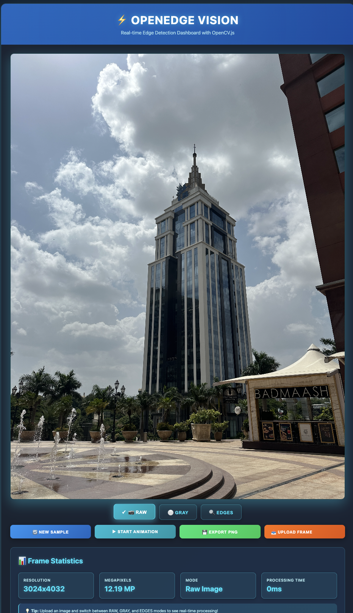<br/>
      <b>RAW Camera Mode</b><br/>
      Original camera feed
    </td>
    <td align="center">
      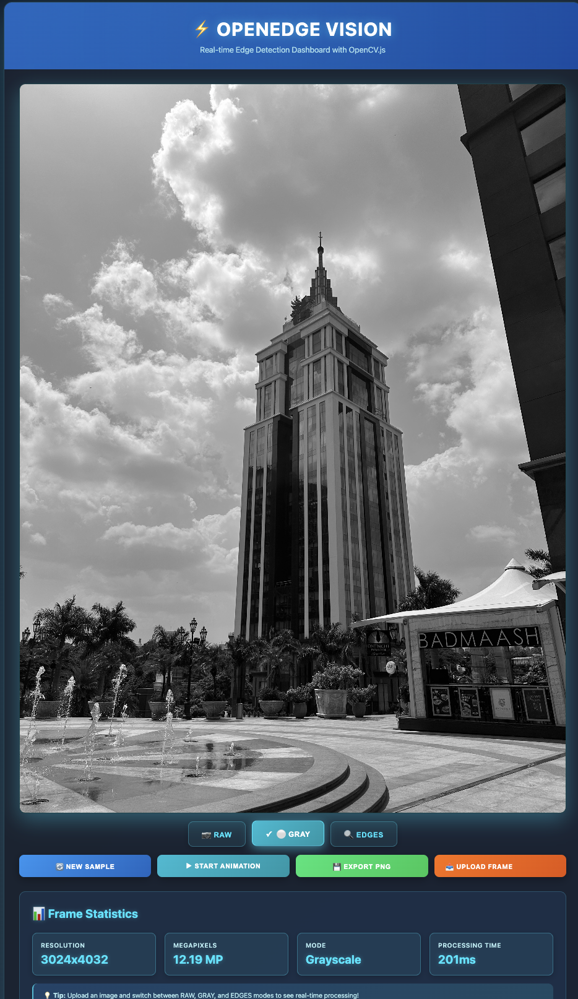<br/>
      <b>Grayscale Mode</b><br/>
      Converted to grayscale
    </td>
    <td align="center">
      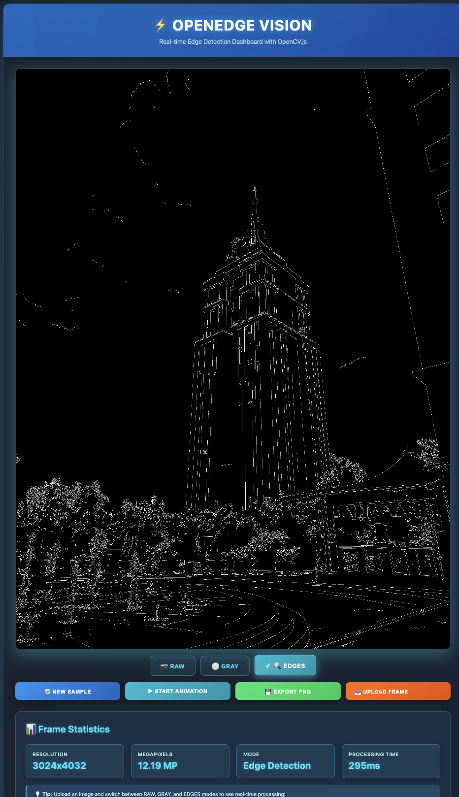<br/>
      <b>Edge Detection</b><br/>
      Real-time Canny edges
    </td>
  </tr>

  <tr>
    <td align="center">
      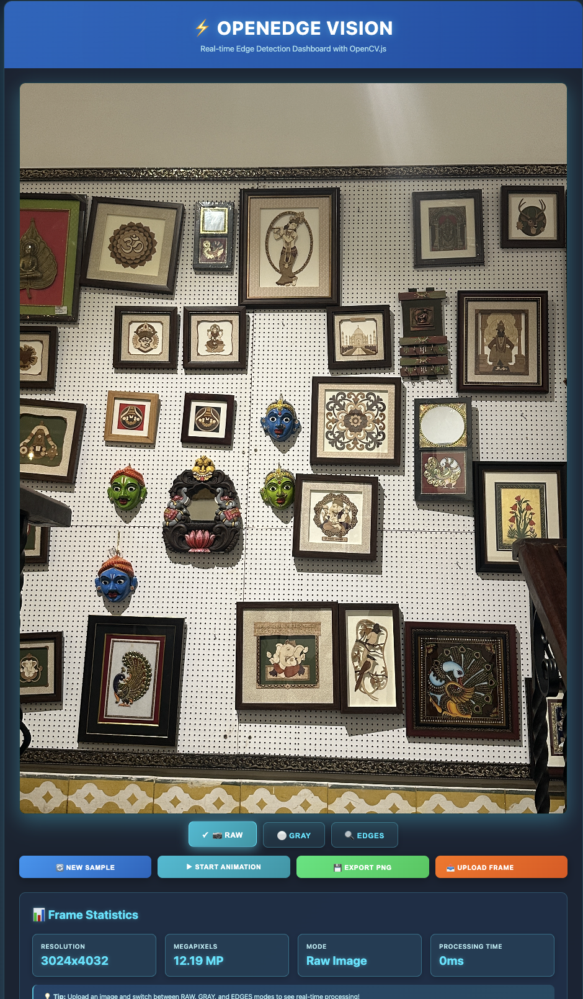<br/>
      <b>RAW Camera Mode</b><br/>
      Original camera feed
    </td>
    <td align="center">
      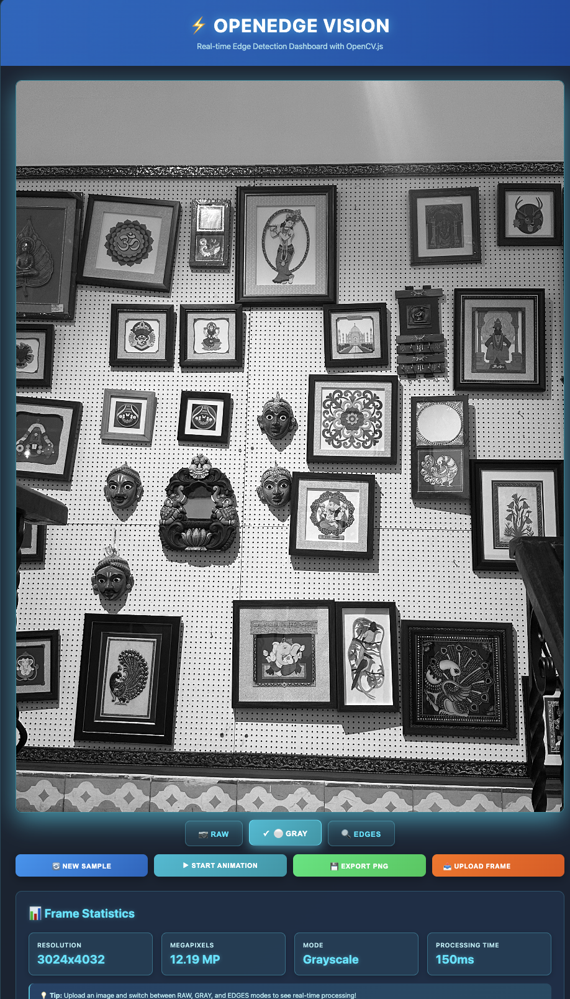<br/>
      <b>Grayscale Mode</b><br/>
      Converted to grayscale
    </td>
    <td align="center">
      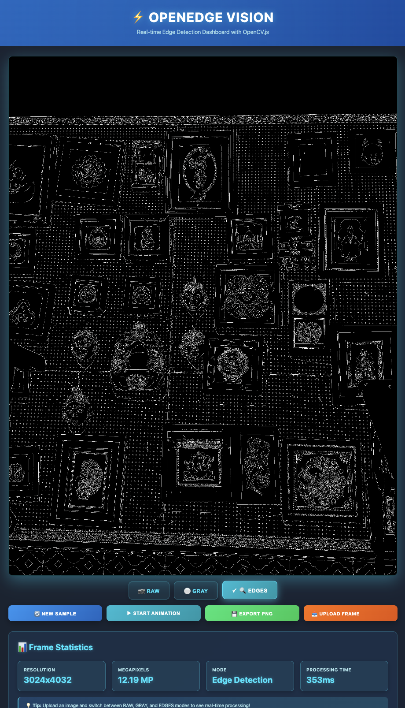<br/>
      <b>Edge Detection</b><br/>
      Real-time Canny edges
    </td>
  </tr>
</table>

---


### Android Setup

#### 1. Clone and Download OpenCV
```bash
git clone https://github.com/yourusername/OpenEdge.git
cd OpenEdge
```

Download the OpenCV Android SDK from [opencv.org/releases](https://opencv.org/releases/). You'll need version 4.9.0 or compatible.

#### 2. Configure OpenCV Path

You have three options:

**Option A: Environment Variable (Recommended)**
```bash
export OPENCV_ANDROID_SDK=/path/to/OpenCV-android-sdk
```

**Option B: Place in Project Root**
```bash
# Place or symlink OpenCV-android-sdk folder in OpenEdge/
```

**Option C: Edit CMakeLists.txt**
Open `app/src/main/cpp/CMakeLists.txt` and update:
```cmake
set(OPENCV_ANDROID_SDK "/your/absolute/path/to/OpenCV-android-sdk")
```

#### 3. Build and Install
```bash
./gradlew clean
./gradlew build
./gradlew installDebug
```

Look for these success messages:
```
✓ BUILD SUCCESSFUL
✓ OpenCV Android SDK found at: /path/to/OpenCV-android-sdk
✓ OpenCV support enabled - edge detection will be available
```

#### Troubleshooting

If you see "OpenCV Android SDK not found":
- Verify the folder exists and contains `sdk/native/jni/`
- Check path in CMakeLists.txt matches exactly
- Try absolute paths instead of relative ones

See [OPENCV_SETUP.md](OPENCV_SETUP.md) for detailed troubleshooting.

---

### Web Viewer Setup
```bash
cd web
npm install
npm run build
npm run serve
```

Open your browser to `http://localhost:3000`

You should see:
- Cyan-themed dashboard
- Upload button and drag-drop zone
- Sample edge pattern display
- Statistics panel

In the browser console, look for:
```
🚀 OpenEdge Vision Viewer Starting...
✅ OpenCV.js loaded and ready
```

---

## How to Use

### Android App

1. **Grant Camera Permission** when prompted
2. **Choose a Mode:**
   - RAW: See the original camera feed
   - GRAY: View grayscale conversion
   - EDGES: Watch real-time edge detection
3. **Monitor Performance** via FPS counter (top-left)
4. **Take Screenshots** to analyze in the web viewer

### Web Viewer

1. **Upload an Image** (button or drag-drop)
2. **Wait for Processing** - you'll see "Processing with OpenCV..."
3. **View Results:**
   - Edge-detected image on canvas
   - Processing time measurement
   - Image statistics

4. **Try Features:**
   - "Generate New Sample" - creates test patterns
   - "Animate" - auto-generates samples at 10 FPS
   - "Export Frame" - downloads current image as PNG

---

### Android Application Modes

> **📸 Add your screenshots here:**  
> Create folder: `docs/screenshots/App_SS/`  
> Add files:
> - `app_raw_mode.jpg` - RAW camera mode
> - `app_grey_mode.jpg` - Grayscale mode  
> - `app_edges_mode.jpg` - Edge detection mode

<!-- Uncomment and add your images here:
<table>
  <tr>
    <td></td>
    <td></td>
    <td></td>
  </tr>
  <tr>
    <td align="center">RAW Mode</td>
    <td align="center">Grayscale Mode</td>
    <td align="center">Edge Detection</td>
  </tr>
</table>
-->

### Web Viewer Interface

> **📸 Add your screenshots here:**  
> Create folder: `docs/screenshots/WebViewer/`  
> Add files:
> - `web_dashboard.png` - Main interface
> - `web_upload.png` - Upload in action
> - `web_stats.png` - Statistics panel

<!-- Uncomment and add your images here:
<table>
  <tr>
    <td></td>
    <td></td>
    <td></td>
  </tr>
  <tr>
    <td align="center">Dashboard</td>
    <td align="center">Processing</td>
    <td align="center">Statistics</td>
  </tr>
</table>
-->


## Technical Details

### Android Architecture

**Processing Pipeline:**
```
Camera2 API → ImageReader (YUV_420_888)
    ↓
JNI Bridge (ByteArray)
    ↓
C++ OpenCV (Canny Edge Detection)
    ↓
OpenGL ES 2.0 (GPU Rendering)
    ↓
Display (Screen)
```

**Key Components:**
- `MainActivity.kt` - Main activity and UI control
- `CameraManager.kt` - Camera2 API wrapper with lifecycle management
- `CameraRenderer.kt` - OpenGL ES 2.0 shader-based renderer
- `EdgeDetection.kt` - JNI bridge to native code
- `edge_detection.cpp` - Native OpenCV implementation

**Processing Parameters:**
```cpp
GaussianBlur(input, blurred, Size(5, 5), 1.5);  // Noise reduction
Canny(blurred, edges, 50, 150);                  // Edge detection
```

### Web Architecture

**Processing Pipeline:**
```
File Upload → FileReader (Base64)
    ↓
Image Element (Load)
    ↓
Canvas Context (Draw)
    ↓
OpenCV.js (Canny Algorithm)
    ↓
Display Canvas (Result)
```

**Key Technologies:**
- TypeScript for type safety and better IDE support
- HTML5 Canvas API for image rendering
- OpenCV.js 4.9.0 (WebAssembly compiled from C++)
- CSS3 animations and gradients
- Async/await for clean asynchronous code

**Why OpenCV.js?**

OpenCV.js is the official WebAssembly build of OpenCV, meaning it runs the actual C++ OpenCV code in the browser. This gives us:
- Real Canny edge detection (not a simulation)
- Performance close to native code
- Consistency with the Android implementation
- No server-side processing needed

---

## Project Structure
```
OpenEdge/
│
├── app/                                  # Android application
│   ├── src/main/
│   │   ├── java/com/openedge/
│   │   │   ├── MainActivity.kt          # Main UI and mode switching
│   │   │   ├── camera/
│   │   │   │   └── CameraManager.kt     # Camera2 lifecycle & frame handling
│   │   │   ├── gl/
│   │   │   │   └── CameraRenderer.kt    # OpenGL rendering pipeline
│   │   │   └── processing/
│   │   │       └── EdgeDetection.kt     # JNI bridge to C++
│   │   ├── cpp/
│   │   │   ├── CMakeLists.txt          # CMake build configuration
│   │   │   ├── edge_detection.cpp      # OpenCV Canny implementation
│   │   │   └── native-lib.cpp          # JNI method exports
│   │   ├── res/                         # Android resources (layouts, drawables)
│   │   └── AndroidManifest.xml
│   └── build.gradle.kts
│
├── web/                                  # Web viewer dashboard
│   ├── src/
│   │   └── main.ts                      # TypeScript application logic
│   ├── dist/                            # Compiled JavaScript (generated)
│   ├── index.html                       # Main HTML structure
│   ├── styles.css                       # Cyan-themed styling
│   ├── package.json                     # Dependencies and scripts
│   └── tsconfig.json                    # TypeScript configuration
│
├── docs/
│   ├── screenshots/
│   │   ├── App_SS/                      # Android app screenshots (add yours here)
│   │   └── WebViewer/                   # Web viewer screenshots (add yours here)
│   ├── Demo_gif/                        # Demo animations (add yours here)
│   └── OPENCV_SETUP.md                  # Detailed OpenCV setup guide
│
├── gradle/                               # Gradle wrapper files
├── .gitignore
├── build.gradle.kts                     # Root build configuration
├── settings.gradle.kts                  # Project settings
└── README.md                            # This file
```

---

## Performance

### Android App

**Tested on mid-range Android device:**
- FPS: 25-30 (consistent)
- Processing time: 15-25ms per frame
- Resolution: 640×480 (optimal balance)
- Memory usage: ~50MB (including OpenCV)

**Note:** Performance varies by device. Older devices may see 15-20 FPS.

### Web Viewer

**Processing times vary by image size:**
- 640×480: ~50ms
- 1920×1080: ~120ms
- 3840×2160 (4K): ~400ms

**First load:** OpenCV.js downloads once (~8MB), then caches.

---

## Algorithm: Canny Edge Detection

The Canny edge detection algorithm is a multi-stage process:

1. **Noise Reduction** - Gaussian blur smooths the image
2. **Gradient Calculation** - Finds edge intensity and direction
3. **Non-maximum Suppression** - Thins edges to single pixels
4. **Double Threshold** - Separates strong and weak edges
5. **Edge Tracking** - Connects edges using hysteresis

**Our Parameters:**
- Gaussian kernel: 5×5 pixels
- Sigma: 1.5 (blur strength)
- Low threshold: 50 (weak edge minimum)
- High threshold: 150 (strong edge minimum)

These values work well for general-purpose edge detection. You can modify them in the source code for different use cases.

---

## Limitations

**Current Limitations:**
- Android app requires physical device testing (not verified in emulator)
- No Android-to-Web live streaming (manual screenshot workflow)
- Fixed Canny thresholds (no runtime adjustment yet)
- Single edge detection algorithm (no Sobel, Laplacian, etc.)

**Known Issues:**
- OpenCV.js initial load can take 2-3 seconds
- Large images (>5MP) may slow down browser
- Android app not tested on all device types

---

## Future Improvements

**Potential Enhancements:**
- [ ] Add adjustable edge detection thresholds
- [ ] Implement other algorithms (Sobel, Prewitt, Laplacian)
- [ ] Add Android-to-Web streaming via WebSocket
- [ ] Support batch image processing
- [ ] Add image filters and preprocessing options
- [ ] Implement comparison view (before/after)
- [ ] Add export history and favorites
- [ ] Create user settings panel

**Contributions welcome!** Feel free to open issues or pull requests.

---

## Technology Stack

### Android
- **Language:** Kotlin 2.0.21
- **Build System:** Gradle 8.13
- **Min SDK:** 24 (Android 7.0 Nougat)
- **Target SDK:** 36 (Android 14+)
- **NDK:** r27
- **OpenCV:** 4.9.0 (C++ via JNI)
- **Graphics:** OpenGL ES 2.0
- **Camera:** Camera2 API

### Web
- **Language:** TypeScript 5.3
- **Build:** Node.js + npm
- **OpenCV:** opencv.js 4.9.0 (WebAssembly)
- **Rendering:** HTML5 Canvas
- **Styling:** CSS3 (modern features)
- **Server:** Built-in Node.js HTTP server (dev)

---

## Resources

### OpenCV Documentation
- [OpenCV Android Setup](https://docs.opencv.org/4.9.0/da/d2a/tutorial_O4A_SDK.html)
- [Canny Edge Detection](https://docs.opencv.org/4.9.0/da/d22/tutorial_py_canny.html)
- [OpenCV.js Tutorial](https://docs.opencv.org/4.9.0/d5/d10/tutorial_js_root.html)

### Android Development
- [Camera2 API Guide](https://developer.android.com/training/camera2)
- [OpenGL ES Overview](https://developer.android.com/guide/topics/graphics/opengl)
- [NDK Getting Started](https://developer.android.com/ndk/guides)

### Useful Tools
- [Android Studio](https://developer.android.com/studio)
- [Visual Studio Code](https://code.visualstudio.com/) (for web development)


---

## Acknowledgments

- OpenCV community for the amazing computer vision library
- Android team for Camera2 API and OpenGL ES documentation
- Emscripten team for making OpenCV.js possible

---

## Contact & Support

**Questions or feedback?** Feel free to:
- Open an issue on GitHub
- Contribute improvements via pull request
- Share your results or use cases

---

*Built with curiosity and caffeine ☕*
